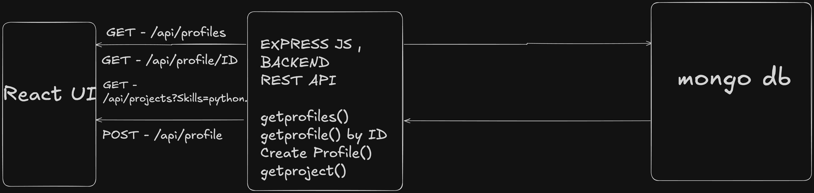

# Me-API Playground

> A RESTful backend system for managing developer profiles and projects with intelligent skill-based filtering capabilities.

[](https://opensource.org/licenses/MIT)
[](https://nodejs.org/)
[](https://www.mongodb.com/)

## 📋 Table of Contents

- [Overview](#overview)
- [Key Features](#key-features)
- [Technology Stack](#technology-stack)
- [System Architecture](#system-architecture)
- [Getting Started](#getting-started)
- [API Documentation](#api-documentation)
- [Database Schema](#database-schema)
- [Use Cases](#use-cases)
- [Contributing](#contributing)
- [License](#license)


## 🎯 Overview

Me-API Playground is a robust backend solution designed to manage developer profiles and projects with advanced filtering capabilities. Perfect for building:

- 🎨 **Developer Portfolio Platforms** - Showcase skills, projects, and experience
- 🔍 **Talent Discovery Systems** - Match developers with opportunities
- 🤖 **AI-Powered Analysis** - Feed structured data to ML models
- 💼 **Investor Pitch Tools** - Evaluate technical capabilities

### 🔗 Repositories

- **Backend:** [predusk-backend-mongodb-express-react](https://github.com/nayaknishant656/predusk-backend-mongodb-express-react)
- **Frontend:** [predusk-frontend-react](https://github.com/nayaknishant656/predusk-frontend-react)
- **Live Demo:** [https://predusk-frontend-react.vercel.app/projects](https://predusk-frontend-react-geyj.vercel.app/)
- ** BACKNED DEMO ** [https://predusk-backend-mongodb-express-rea-eta.vercel.app/api/profiles](https://predusk-backend-mongodb-express-rea-eta.vercel.app/api/profiles)

## ✨ Key Features

- ✅ RESTful API architecture
- ✅ Full CRUD operations for developer profiles
- ✅ Skill-based project filtering
- ✅ MongoDB document storage with indexing
- ✅ Nested sub-documents for projects and work experience
- ✅ Auto-generated timestamps
- ✅ Optimized for AI/ML integration
- ✅ React frontend ready

## 🛠 Technology Stack

| Component | Technology |
|-----------|-----------|
| **Runtime** | Node.js |
| **Framework** | Express.js |
| **Database** | MongoDB |
| **ODM** | Mongoose |
| **API Style** | REST |
| **Frontend** | React |

## 🏗 System Architecture


The system architecture is shown below:




```
┌─────────────┐      ┌──────────────┐      ┌──────────────┐      ┌──────────┐
│   React     │─────▶│  REST APIs   │─────▶│  Express.js  │─────▶│ MongoDB  │
│   Client    │      │              │      │ Controllers  │      │          │
└─────────────┘      └──────────────┘      └──────────────┘      └──────────┘
                                                                        │
                                                                        ▼
                                                                 JSON Response
```

**Data Flow:**
1. React client sends HTTP requests to REST endpoints
2. Express.js routes requests to appropriate controllers
3. Controllers interact with MongoDB via Mongoose ODM
4. Structured data is returned as JSON responses

## 🚀 Getting Started

### Prerequisites

- Node.js (v14.0.0 or higher)
- MongoDB (v4.0 or higher)
- npm or yarn

### Installation

```bash
# Clone the backend repository
git clone https://github.com/nayaknishant656/predusk-backend-mongodb-express-react.git
cd predusk-backend-mongodb-express-react

# Install dependencies
npm install

# Create environment file
cp .env.example .env

# Configure your environment variables (see below)
# Edit .env with your settings

# Start MongoDB (if running locally)
mongod

# Start the development server
npm run dev

# Or start in production mode
npm start
```

### Environment Configuration

Create a `.env` file in the root directory:

```env
# Server Configuration
PORT=5000
NODE_ENV=development

# Database Configuration
MONGODB_URI=mongodb://localhost:27017/me-api

# Optional: MongoDB Atlas (Cloud)
# MONGODB_URI=mongodb+srv://<username>:<password>@cluster.mongodb.net/me-api?retryWrites=true&w=majority
```

### Verify Installation

Once the server is running, visit:
```
http://localhost:5000/api/profiles
```

You should receive a JSON response with all profiles (empty array if no data exists).

## 📚 API Documentation

### Base URL

```
http://localhost:5000/api
```

### Endpoints

#### 1. Get All Profiles

Retrieve all developer profiles from the database.

```http
GET /api/profiles
```

**Response:**
```json
[
  {
    "_id": "507f1f77bcf86cd799439011",
    "name": "David Kim",
    "email": "dkim@fullstack.io",
    "skills": ["Next.js", "TypeScript", "Prisma"],
    "projects": [...],
    "work": [...]
  }
]
```

---

#### 2. Get Profile by ID

Retrieve a specific profile using its MongoDB ObjectId.

```http
GET /api/profiles/:id
```

**Parameters:**
- `id` (path) - MongoDB ObjectId (e.g., `507f1f77bcf86cd799439011`)

**Response:**
```json
{
  "_id": "507f1f77bcf86cd799439011",
  "name": "David Kim",
  "email": "dkim@fullstack.io",
  "education": "B.S. Engineering, UCLA",
  "skills": ["Next.js", "TypeScript", "Prisma", "PostgreSQL"],
  "projects": [
    {
      "title": "SaaS Starter",
      "description": "Boilerplate for SaaS apps",
      "links": ["https://saas-starter.com"]
    }
  ],
  "work": [
    {
      "company": "StartupX",
      "position": "Fullstack Dev",
      "description": "Built the MVP from scratch."
    }
  ],
  "links": {
    "github": "github.com/dkim",
    "linkedin": "linkedin.com/in/dkim",
    "portfolio": "davidkim.dev"
  },
  "createdAt": "2024-01-15T10:30:00.000Z",
  "updatedAt": "2024-01-15T10:30:00.000Z"
}
```

---

#### 3. Create Profile

Create a new developer profile.

```http
POST /api/profiles
```

**Request Body:**
```json
{
  "name": "David Kim",
  "email": "dkim@fullstack.io",
  "education": "B.S. Engineering, UCLA",
  "skills": ["Next.js", "TypeScript", "Prisma", "PostgreSQL"],
  "projects": [
    {
      "title": "SaaS Starter",
      "description": "Boilerplate for SaaS apps",
      "links": ["https://saas-starter.com"]
    }
  ],
  "work": [
    {
      "company": "StartupX",
      "position": "Fullstack Dev",
      "description": "Built the MVP from scratch."
    }
  ],
  "links": {
    "github": "github.com/dkim",
    "linkedin": "linkedin.com/in/dkim",
    "portfolio": "davidkim.dev"
  }
}
```

**Response:**
```json
{
  "_id": "507f1f77bcf86cd799439011",
  "name": "David Kim",
  ...
}
```

---

#### 4. Get Projects by Skill

Filter projects by a specific technology skill.

```http
GET /api/projects?skills=Python
```

**Query Parameters:**
- `skills` - Technology skill (e.g., `Python`, `JavaScript`, `React`, `TypeScript`)

**Response:**
```json
[
  {
    "profileId": "507f1f77bcf86cd799439011",
    "projects": [
      {
        "title": "Data Pipeline",
        "description": "ETL system using Python",
        "links": ["https://github.com/user/data-pipeline"]
      }
    ]
  }
]
```

### Route Configuration

```javascript
const { 
  getProfiles, 
  getProfileById, 
  createProfile, 
  getProjects 
} = require('../controllers/profileController');

router.get('/projects', getProjects);
router.get('/', getProfiles);
router.get('/:id', getProfileById);
router.post('/', createProfile);
```

## 🗄 Database Schema

### Profile Collection

The system uses a single `Profile` collection with embedded sub-documents for optimal query performance.

#### Schema Structure

| Field | Type | Required | Indexed | Description |
|-------|------|----------|---------|-------------|
| `_id` | ObjectId | Auto | Yes | Unique primary key |
| `name` | String | Yes | No | Developer's full name |
| `email` | String | Yes | Yes | Unique email (login/contact) |
| `education` | String | No | No | Educational background |
| `skills` | Array[String] | No | No | Technology skills |
| `projects` | Array[Object] | No | No | Portfolio projects |
| `work` | Array[Object] | No | No | Work experience |
| `links` | Object | No | No | Social/professional URLs |
| `createdAt` | Date | Auto | No | Profile creation timestamp |
| `updatedAt` | Date | Auto | No | Last update timestamp |

#### Sub-Document Schemas

**Project Object:**
```javascript
{
  title: String,
  description: String,
  links: [String]
}
```

**Work Object:**
```javascript
{
  company: String,
  position: String,
  description: String
}
```

**Links Object:**
```javascript
{
  github: String,
  linkedin: String,
  portfolio: String
}
```

#### Sample Document

```json
{
  "_id": "507f1f77bcf86cd799439011",
  "name": "David Kim",
  "email": "dkim@fullstack.io",
  "education": "B.S. Engineering, UCLA",
  "skills": ["Next.js", "TypeScript", "Prisma", "PostgreSQL"],
  "projects": [
    {
      "title": "SaaS Starter",
      "description": "Boilerplate for SaaS apps",
      "links": ["https://saas-starter.com"]
    }
  ],
  "work": [
    {
      "company": "StartupX",
      "position": "Fullstack Dev",
      "description": "Built the MVP from scratch."
    }
  ],
  "links": {
    "github": "github.com/dkim",
    "linkedin": "linkedin.com/in/dkim",
    "portfolio": "davidkim.dev"
  },
  "createdAt": "2024-01-15T10:30:00.000Z",
  "updatedAt": "2024-01-15T10:30:00.000Z"
}
```

## 🎯 Use Cases

### 1. Developer Portfolio Platform
Build a platform where developers can:
- Create and manage their profiles
- Showcase projects and skills
- Connect with recruiters and clients

### 2. Talent Discovery System
Enable recruiters to:
- Search developers by skills
- Filter candidates by experience
- Access comprehensive profiles

### 3. AI-Powered Profile Analysis
Leverage the API for ML models to:
- Generate embeddings from structured data
- Perform semantic skill matching
- Evaluate technical capabilities
- Predict project success rates

### 4. Investor Pitch Evaluation
Assess startup teams by:
- Analyzing founder technical skills
- Reviewing past projects
- Evaluating team composition

## 🤖 AI and ML Compatibility

This API is optimized for AI/ML integration:

✅ **Structured Schema** - Predictable format for reliable processing  
✅ **Skill-Based Filtering** - Enables semantic matching algorithms  
✅ **Nested Documents** - Perfect for embedding generation  
✅ **Clean Separation** - Clear distinction between entities  
✅ **JSON Format** - Universal compatibility with ML frameworks

## 🧪 Testing

```bash
# Run all tests
npm test

# Run with coverage
npm run test:coverage

# Run in watch mode
npm run test:watch
```

## 📦 Project Structure

```
me-api-playground/
├── controllers/
│   └── profileController.js
├── models/
│   └── Profile.js
├── routes/
│   └── profileRoutes.js
├── config/
│   └── database.js
├── middleware/
│   └── errorHandler.js
├── .env.example
├── .gitignore
├── package.json
├── server.js
└── README.md
```

## 🤝 Contributing

Contributions are welcome! Please follow these steps:

1. Fork the repository
2. Create a feature branch (`git checkout -b feature/amazing-feature`)
3. Commit your changes (`git commit -m 'Add amazing feature'`)
4. Push to the branch (`git push origin feature/amazing-feature`)
5. Open a Pull Request

Please ensure your code follows the existing style and includes appropriate tests.

## 📄 License

This project is licensed under the MIT License - see the [LICENSE](LICENSE) file for details.

## 📞 Contact & Support

- **Issues:** [GitHub Issues](https://github.com/nayaknishant656/predusk-backend-mongodb-express-react/issues)
- **Email:** [Your Contact Email]
- **Documentation:** [Wiki](https://github.com/nayaknishant656/predusk-backend-mongodb-express-react/wiki)

## 🙏 Acknowledgments

- Built with Express.js and MongoDB
- Designed for seamless React integration
- Optimized for AI/ML applications

---

**Made with ❤️ for the developer community** | [⭐ Star this repo](https://github.com/nayaknishant656/predusk-backend-mongodb-express-react)
